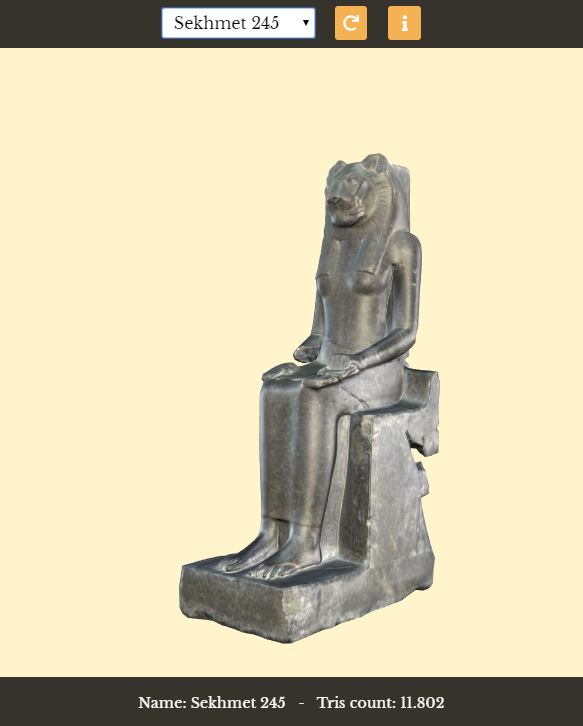

# Sekhmet 3D
This app is the final part of the project I did for MSc Thesis in Cinema and Media Engineer.

## Overview
The goal of the whole project was to create low-poly 3D models and use them in an interactive context, such as a web app. The models are statues representing the Sekhmet goddess, and were 3D-scanned by the Turin's Museo Egizio. The project started with the optimization of the assets and ended with the development of a web viewer.

## How it works
Use the dropdown list to choose the model you want to display. Once the model is loaded, you can rotate/pan/zoom the camera around it. You can switch to another model at any time. Two orange buttons allows to rotate the model and to toggle some information about the model.

## Technologies
Blender is the main 3D DCC tool for 3D models editing (retopology, uv-mapping, baking... ). The web app is entirely based on Three.js library. Some data are fetched from a JSON file via XHR.

## Resources
* Blender: https://www.blender.org/
* Three.js: https://threejs.org/
